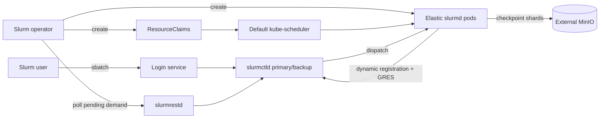

# Heterogeneous GPU/TPU/CPU Orchestration

> **Status:** foundation complete. Version pins, Go module identities, build
> targets, and compile-only component entrypoints exist; no component behavior
> is implemented yet.

This project defines a Slurm-on-Kubernetes platform for heterogeneous compute:
physical NVIDIA GPUs, physical CPUs, and simulated OpenTPU accelerators. Users
submit native Slurm jobs. Kubernetes owns placement and device isolation;
Slurm owns queuing and job execution; MinIO owns durable checkpoints.

The platform is intended to make a hardware failure boring: isolate the bad
Kubernetes node, drain its Slurm workers, requeue only affected jobs from their
latest checkpoint, reboot and verify the node, then return it to service only
when every check passes.

## What the platform will provide

- A Kubernetes operator that owns the complete Slurm cluster: primary and
  backup `slurmctld`, `slurmrestd`, `slurmdbd`, login services, partitions, and
  elastic `slurmd` workers.
- One project-owned, multi-provider DRA driver for NVIDIA GPUs, CPU/NUMA memory
  topology, and OpenTPU simulation slots.
- Exact NUMA matching on dedicated compute nodes without a custom
  `kube-scheduler` binary.
- Deterministic translation from allocated Kubernetes DRA devices into Slurm
  CPU, memory, feature, and GRES declarations.
- Application-level, framework-neutral checkpoints stored as a JSON manifest
  and raw tensor shards in MinIO.
- A node-wide quantization engine for canonical floating point ↔ OpenTPU INT8
  conversion.
- Node Problem Detector checks plus `watchdog-daemon` for quarantine support,
  reboot, and post-reboot verification.

## Supported resource model

| Resource | Backing | Kubernetes allocation | Slurm representation |
| --- | --- | --- | --- |
| NVIDIA GPU | Physical GPU, initially RTX 4050 | NVIDIA DRA provider | `gres/gpu:<model>` |
| CPU | Physical cores | CPU DRA provider | `CPUs` on the dynamic node |
| Memory | Physical NUMA memory | NUMA-memory DRA provider plus Pod limits | `RealMemory` |
| OpenTPU | UCSB OpenTPU PyRTL simulation | OpenTPU DRA provider | `gres/tpu:opentpu_<profile>` |

OpenTPU is an executable hardware and functional simulation, not a physical TPU
device. The platform does not claim otherwise; see the
[upstream project](https://github.com/UCSBarchlab/OpenTPU).

## Control flow

The operator creates workers only for eligible pending demand. Each worker is
one NUMA-aligned resource slice, not an entire physical machine. Kubernetes
allocates the slice before `slurmd` registers it with Slurm.

## Guarantees and boundaries

- Kubernetes `resource.k8s.io/v1` objects are the authority for allocation.
- Slurm is the authority for job, queue, and dynamic-node state.
- A MinIO checkpoint is recoverable only when its `.complete` commit object and
  every checksum validate.
- Hardware quarantine is node-granular because v1 uses stable Kubernetes APIs
  only. One degraded device isolates its physical node.
- Exact NUMA placement requires dedicated compute nodes. Unrelated Pods are not
  admitted to those nodes.
- A hard failure can lose work performed since the most recent completed
  checkpoint. Transparent CRIU checkpointing is not part of v1.
- GPU sharing, MIG, physical TPU support, and operator-managed MariaDB or MinIO
  are not part of v1.

## Documentation

- [Architecture](docs/architecture.md)
- [Repository layout](docs/repository-layout.md)
- [Scheduling and resources](docs/scheduling-and-resources.md)
- [Checkpoint format and protocol](docs/checkpointing.md)
- [Failure recovery](docs/failure-recovery.md)
- [Implementation plan](docs/implementation-plan.md)
- [Checkpoint manifest v2 JSON Schema](docs/schemas/checkpoint-manifest-v2.schema.json)

## Platform baseline

- Go 1.26.7.
- Kubernetes 1.35.6, using stable APIs and feature states only.
- Slurm 25.11.7 with `select/cons_tres`, configless operation, dynamic
  nodes, MUNGE authentication, and JWT support for REST clients.
- OpenTPU revision `ca5d381c93752a504e8de1fa10c9d51649853c70`.
- A CDI/NRI-capable Linux container runtime.
- Dedicated compute nodes, an external TLS-enabled MariaDB service, an external
  TLS-enabled MinIO service, and RWX storage for Slurm controller state.

[`versions.mk`](versions.mk) is authoritative for these software pins. Run
`make versions` to print them, `make build` or `make test` for all modules, and
`make verify` for the complete local verification suite. `make generate` and
`make manifests` expose generation and Kustomize rendering without applying
anything to a cluster.

The design builds on Kubernetes
[Dynamic Resource Allocation](https://kubernetes.io/docs/concepts/scheduling-eviction/dynamic-resource-allocation/),
Slurm [dynamic nodes](https://slurm.schedmd.com/dynamic_nodes.html) and
[GRES](https://slurm.schedmd.com/gres.html), and Kubernetes
[Node Problem Detector](https://github.com/kubernetes/node-problem-detector).
