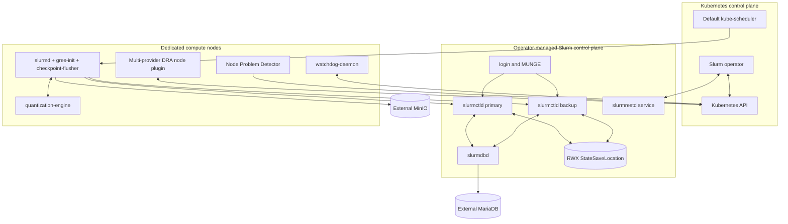

# Architecture

## Goals

The platform runs native Slurm workloads on Kubernetes-managed compute. It
must allocate heterogeneous resources without double booking, recover affected
jobs after hardware failure, and preserve enough application state that a
requeued job resumes from a recent checkpoint.

The first release targets:

- physical NVIDIA GPUs, initially an RTX 4050;
- physical CPU cores and NUMA-local memory; and
- the PyRTL OpenTPU simulator with explicit CPU and memory footprints.

It deliberately does not target physical TPUs, general Kubernetes workloads on
compute nodes, transparent process checkpointing, or partial GPU sharing.

## Sources of truth

| State | Authority | Derived consumers |
| --- | --- | --- |
| Hardware inventory and allocation | Kubernetes `ResourceSlice` and `ResourceClaim` | Operator, `gres-init`, verifier |
| Raw physical-node health | NPD `HardwareFaultDetected` Node condition | Operator |
| Quarantine and recovery phase | Operator-owned Node condition, taint, and annotations | Scheduler and `watchdog-daemon` |
| Jobs, queues, partitions, and dynamic nodes | Slurm | Operator and users |
| Checkpoint durability | MinIO `.complete` object and referenced hashes | Restarting applications |
| Desired cluster configuration | `HeterogeneousCluster` custom resource | Operator-managed workloads |

State flows in one direction at each boundary. DRA allocation becomes Slurm
configuration; Slurm does not mutate DRA objects. Kubernetes health becomes a
Slurm drain; manual Slurm `RESUME` cannot override a degraded Kubernetes node.

## Components



### Slurm operator

One leader-elected Deployment reconciles the complete cluster:

- stable primary and backup controller identities;
- shared configuration and controller state;
- `slurmrestd`, `slurmdbd`, and login services;
- partitions and elastic worker capacity;
- DRA claims, worker Pods, and dynamic-node cleanup; and
- the hardware-recovery state machine.

Kubernetes watches drive reconciliation. Pending Slurm demand is polled through
`slurmrestd` every five seconds because Slurm does not provide a watch stream.
If `slurmrestd` is unavailable, the operator preserves existing workers and
does not scale down, requeue, or reboot nodes based on incomplete state.

### Slurm control plane

Two `slurmctld` Pods have stable hostnames. The first configured
`SlurmctldHost` is primary and the second is backup. Both mount the same RWX
`StateSaveLocation`, use required anti-affinity, and are protected by a Pod
disruption budget. Slurm requires every controller to have read/write access to
that shared state; see the official [high-availability guidance](https://slurm.schedmd.com/quickstart_admin.html#HA).

`slurmrestd` is a two-replica Deployment behind a ClusterIP Service.
`slurmdbd` is a single restartable Pod backed by an administrator-managed
MariaDB database. Login Pods run MUNGE and provide native `sbatch`, `srun`, and
`squeue` clients. The operator does not deploy MariaDB, MinIO, identity
providers, or the RWX storage system.

Daemon-to-daemon communication uses `auth/munge`. Operator REST traffic uses a
dedicated, short-lived JWT with the minimum Slurm privileges needed to inspect
jobs and manage dynamic nodes. MUNGE keys are mounted only into Slurm daemons;
JWT signing material is mounted only into the REST trust boundary and its
trusted token issuer.

### DRA and node services

One `dra-driver` module and node-plugin image owns four provider implementations:

| Provider | Published devices | Prepare behavior |
| --- | --- | --- |
| NVIDIA | One device per physical GPU | Inject device files and libraries with CDI; expose stable UUID and topology |
| CPU | Individual physical cores | Pin the selected CPU set with CDI/NRI |
| NUMA memory | Fixed-size memory units | Apply the selected NUMA memory policy with CDI/NRI |
| OpenTPU simulation | Configured virtual simulator slots | Inject the selected PyRTL profile and shared-memory layout |

Node Problem Detector publishes raw hardware fault conditions. The separate
privileged `watchdog-daemon` executes fixed inventory, reboot, and verification
operations for its own node. It cannot select another node, alter Slurm jobs,
or execute arbitrary annotation content.

The node-wide `quantization-engine` DaemonSet converts canonical floating-point
buffers to and from OpenTPU INT8 buffers. It shares only a namespaced
`/dev/shm/ai-orch` mount and a versioned Unix-socket protocol with workers; it
does not own checkpoint storage or commits.

### Elastic worker

A worker Pod represents one NUMA-aligned Slurm node. Its containers use the
`slurm-compute-node` image, which bundles MUNGE, `slurmd`, and the worker tools:

1. a `gres-init` init container that validates allocated claims and writes
   `gres.conf` plus the dynamic `slurmd` configuration to an `emptyDir`;
2. the MUNGE-authenticated `slurmd` container, started with `-Z`; and
3. a `checkpoint-flusher` sidecar sharing memory-backed staging with job
   processes and the node-wide quantization engine.

The Pod uses Guaranteed QoS: integer CPU and memory requests equal limits.
Resource claims provide exclusive CPU, memory-unit, GPU, and OpenTPU devices.
The worker does not start when any claim, topology, CDI, or GRES validation is
incomplete.

## Public API

The initial public API is a single namespaced resource. Native Slurm remains the
only job-submission API, so no workload CRD is introduced.

```yaml
apiVersion: orchestration.gputpu.io/v1alpha1
kind: HeterogeneousCluster
metadata:
  name: research
  namespace: slurm-system
spec:
  slurmVersion: "25.11"
  controlPlane:
    controllers:
      image: registry.example/slurm:25.11
      replicas: 2
      stateSaveClaim: slurm-state-rwx
    rest:
      replicas: 2
    accounting:
      databaseSecretRef: slurm-mariadb
    login:
      replicas: 1
  authentication:
    mungeKeySecretRef: slurm-munge
    jwtKeySecretRef: slurm-jwt
  checkpoint:
    endpoint: https://minio.example
    bucket: checkpoints
    credentialsSecretRef: checkpoint-minio
    interval: 5m
    failureGracePeriod: 120s
  workerPools:
    - name: strict
      partition: compute
      nodeSelector:
        orchestration.gputpu.io/compute-node: "true"
      memoryUnit: 1Gi
      scaling:
        minReady: 0
        maxWorkers: 32
        idleTimeout: 5m
      profiles:
        - name: rtx-4050
          gres: gpu:rtx_4050
          deviceClassName: nvidia.gputpu.io
        - name: opentpu-m8
          gres: tpu:opentpu_m8
          deviceClassName: opentpu-sim.gputpu.io
  recovery:
    automaticReboot: true
    maxAutomaticReboots: 1
    verificationTimeout: 2m
```

The admission webhook rejects configurations that cannot be made safe, such as
controller replicas other than two, a missing RWX state claim, non-integral
memory units, duplicate Slurm GRES mappings, or recovery enabled without a
verifier profile.

Status reports `ControlPlaneReady`, `AccountingReady`, `WorkersReady`,
`CheckpointStoreReachable`, and `DegradedNodes`, plus per-pool ready, pending,
and draining worker counts. Conditions include an observed generation and a
human-readable reason.

## Node contract

The following names are stable interfaces:

- raw NPD condition: `HardwareFaultDetected`;
- operator condition: `HardwareDegraded`;
- quarantine taint:
  `orchestration.gputpu.io/hardware-degraded=true:NoSchedule`;
- compute-node taint:
  `orchestration.gputpu.io/dedicated=compute:NoSchedule`;
- reboot request annotation:
  `orchestration.gputpu.io/reboot-request=<incident-uuid>`; and
- recovery phase annotation:
  `orchestration.gputpu.io/recovery-phase=<phase>`.

The operator owns the derived condition, taints, and recovery annotations. NPD
owns only its raw condition. The watchdog daemon executes each incident UUID at
most once. The operator confirms a reboot by observing a changed
`Node.status.nodeInfo.bootID`.

## Security boundaries

- Only the DRA driver and cluster administrators may write `ResourceSlice` or
  `DeviceClass`; only the operator may create worker claims.
- The operator can patch only labeled compute Nodes and resources it owns.
- The watchdog daemon is privileged but watches only its own Node and accepts
  only a reboot request with a new incident UUID.
- MinIO communication uses TLS. Credentials are Secret-backed and restricted to
  the cluster checkpoint prefix.
- Worker and quantization processes validate cluster, job, rank, transaction,
  ownership, and byte bounds before opening shared-memory paths.
- Checkpoint paths, lengths, hashes, tensor shapes, and byte ranges are validated
  before allocation or file access.
- V1 assumes trusted Slurm users within one administrative tenant. Untrusted
  multi-tenancy and a per-job credential broker are future work.

## Observability

The operator emits Kubernetes Events for state transitions and metrics for
reconcile errors, pending-demand age, claim allocation latency, worker startup,
GRES mismatches, idle capacity, checkpoint freshness, recovery duration, reboot
attempts, and verifier results. Alerts cover controller failover, unavailable
Slurm REST/accounting, stale checkpoints, workers stuck before registration,
and nodes left in a recovery phase beyond its timeout.
