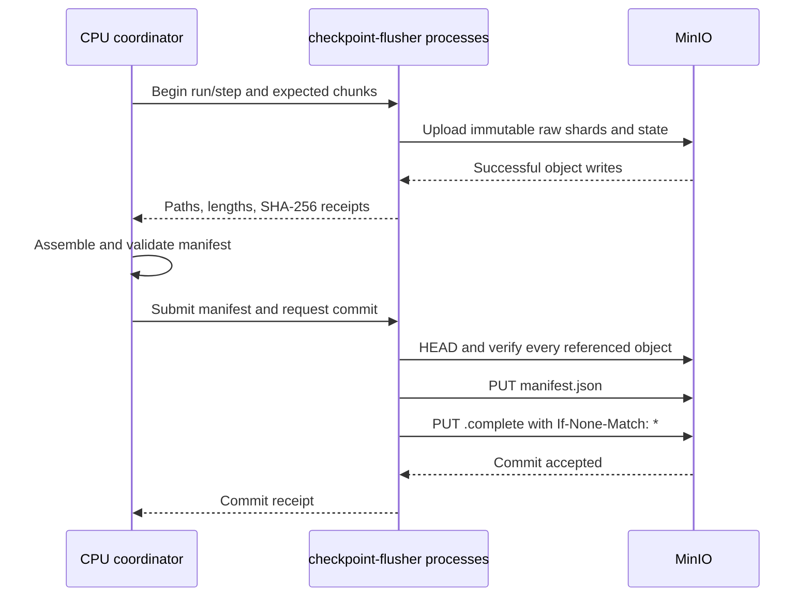

# Checkpoint Format and Protocol

## Guarantee

Checkpointing is application-level and coordinated across the complete Slurm
job. A successful restart restores model, optimizer, scheduler, random-number,
and input-progress state from the newest committed checkpoint. It may repartition
canonical tensors for a different worker layout or supported hardware adapter.

The recovery point objective is the configured checkpoint interval, five
minutes by default. A hard device or node failure can make a final checkpoint
impossible, so the platform never promises zero data loss. It does promise not
to restore a partial or corrupt save.

Container memory snapshots and CRIU are not used. Kubernetes' checkpoint API is
primarily a container-runtime mechanism and does not provide a portable
distributed accelerator checkpoint contract; see the
[Kubelet Checkpoint API](https://kubernetes.io/docs/reference/node/kubelet-checkpoint-api/).

## Storage layout

All paths are relative to the configured MinIO bucket:

```text
checkpoints/
└── run_hetero_v1/
    ├── step_00012500/
    │   ├── manifest.json
    │   ├── optimizer_state.json
    │   ├── rng/
    │   │   ├── rank_00000.bin
    │   │   └── rank_00001.bin
    │   └── shards/
    │       ├── layer_0_q_proj_0.bin
    │       ├── layer_0_q_proj_1.bin
    │       └── layer_0_mlp_dense_0.bin
    └── step_00012500.complete
```

Step prefixes and their objects are immutable. Writers never rename objects and
never reuse a step. Bucket lifecycle policy, not the operator, removes abandoned
multipart uploads, uncommitted prefixes, or checkpoints outside the retention
window.

The durable objects are headerless raw `.bin` chunks described by the manifest.
Safetensors is supported only as a validated import/export format at workload
boundaries; it does not replace the manifest or change the stored shard format.

## Manifest v2

[`checkpoint-manifest-v2.schema.json`](schemas/checkpoint-manifest-v2.schema.json)
is normative. The JSON Schema is closed by default: unknown structural fields
are rejected unless a specifically application-owned state object permits them.
A complete validating specimen is available as
[`checkpoint-manifest-v2.example.json`](schemas/checkpoint-manifest-v2.example.json).

The manifest contains no tensor bytes. It describes:

- run, step, epoch, timestamp, model, dataset, framework, image, and adapter
  compatibility;
- the original distributed world and each rank's hardware adapter;
- canonical model, buffer, optimizer, and application tensors;
- tensor shape, dtype, C layout, little-endian byte order, and optional
  quantization;
- every chunk's global slice, raw-object byte range, byte length, SHA-256, and
  writer rank; and
- optimizer scalar metadata, scheduler state, RNG artifacts, and data cursor.

Optimizer tensor state such as momentum or variance belongs in `tensors` with
`role: optimizer_tensor`. `optimizer_state.json` contains scalars and the mapping
from optimizer slots to those tensors; it must not embed weights or pickle data.
Its closed public format is
[`checkpoint-optimizer-state-v1.schema.json`](schemas/checkpoint-optimizer-state-v1.schema.json).

An abbreviated manifest is shown below. Hashes are shortened only for display;
real manifests require 64 lowercase hexadecimal characters.

```json
{
  "checkpoint_version": 2,
  "run_id": "run_hetero_v1",
  "global_step": 12500,
  "epoch": 4,
  "created_at": "2026-08-19T18:00:00Z",
  "metadata": {
    "total_parameters": 125000000,
    "canonical_dtype": "float32",
    "model_id": "hetero-transformer-v1",
    "model_schema_hash": "<sha256>",
    "dataset_id": "dataset-v3",
    "container_image_digest": "sha256:<digest>",
    "framework": "pytorch",
    "framework_version": "2.x",
    "adapter_versions": {
      "cpu": "1.0.0",
      "nvidia-gpu": "1.0.0",
      "opentpu-sim": "1.0.0"
    }
  },
  "world": {
    "size": 2,
    "ranks": [
      {"rank": 0, "hardware": "nvidia-gpu", "adapter": "pytorch-raw"},
      {"rank": 1, "hardware": "opentpu-sim", "adapter": "pyrtl-int8"}
    ]
  },
  "tensors": {
    "transformer.layer_0.attention.q_proj": {
      "role": "model_parameter",
      "global_shape": [2048, 2048],
      "canonical_dtype": "float32",
      "byte_order": "little",
      "layout": "C",
      "chunks": [
        {
          "chunk_id": "chunk_0001",
          "storage_path": "shards/layer_0_q_proj_0.bin",
          "slice": [[0, 2048], [0, 1024]],
          "shape": [2048, 1024],
          "byte_offset": 0,
          "byte_length": 8388608,
          "sha256": "<sha256>",
          "writer_rank": 0
        }
      ]
    }
  },
  "state": {
    "optimizer_metadata": {
      "storage_path": "optimizer_state.json",
      "byte_length": 512,
      "sha256": "<sha256>"
    },
    "scheduler": {"name": "cosine", "last_step": 12500},
    "rng": {
      "0": {
        "storage_path": "rng/rank_00000.bin",
        "byte_length": 8192,
        "sha256": "<sha256>"
      }
    },
    "data_cursor": {"shard": 18, "sample": 2048}
  }
}
```

Schema validation is necessary but not sufficient. The loader also verifies
that tensor slices are in bounds, non-overlapping, and cover the required global
tensor; shapes match slices; byte ranges fit their objects; byte lengths match
shape and dtype; chunk IDs and paths are unique; ranks are unique and in range;
and optimizer references resolve.

## Commit protocol



The sibling `.complete` object is JSON containing `checkpoint_version`,
`global_step`, `manifest_sha256`, `committed_at`, and the authenticated
`slurm_job_id`. The job ID lets recovery correlate a post-signal commit to the
affected Slurm job; older markers without it remain readable but cannot satisfy
that recovery barrier. The marker is written last with `If-None-Match: *`. A
repeated commit with the same hash is idempotent; a different hash for the same
step is a conflict. MinIO supports conditional PUT operations with
`If-None-Match`; see its
[S3 API compatibility](https://docs.min.io/aistor/developers/s3-api-compatibility/).

HTTP success from an upload alone is not a commit. At the coordinator's commit
request, its local flusher performs `HEAD` for every object and compares the
recorded length and application-computed SHA-256. S3 ETags are retained for
diagnostics but are not used as content hashes because multipart ETags are not
portable SHA-256 values.

## Worker-side interface

Each worker has one `checkpoint-flusher` process listening on the Unix socket
`/run/gputpu-checkpoint/flusher.sock`, mode `0660`, shared only with Slurm job
processes. Requests include `X-Slurm-Job-Id`; v1 assumes one trusted
administrative tenant.

Checkpointing is enabled by setting
`spec.checkpointing.objectStoreSecretRef`. The referenced Secret contains
`endpoint`, `bucket`, `accessKey`, `secretKey`, and an optional `ca.crt`.
The endpoint must be HTTPS and credentials are mounted only into the flusher.

| Operation | Behavior |
| --- | --- |
| `POST /v1/transactions/{transaction}` | Create one or two bounded ring streams for the local job and rank |
| `DELETE /v1/transactions/{transaction}` | Abort and remove the job-owned local staging directory |
| `PUT /v1/checkpoints/{run}/{step}/chunks/{chunk}` | Stream raw bytes, compute SHA-256, upload the immutable object, return a receipt |
| `GET /v1/checkpoints/{run}/{step}/chunks/{chunk}` | Validate manifest authorization and stream the verified byte range |
| `GET /v1/checkpoints/{run}/latest` | Return the newest valid commit and manifest metadata |
| `POST /v1/checkpoints/{run}/{step}/commit` | Rank-zero coordinator submits a manifest; the flusher validates and creates the commit marker |

Run, step, chunk, and object paths are validated against the schema before use.
The flusher rejects absolute paths, `..`, symlinks outside the shared directory,
oversized bodies, length mismatches, and a job ID that does not own the local
request. MinIO calls use TLS, bounded retries, deadlines, and prefix-scoped
credentials from a Kubernetes Secret.

`checkpoint-flusher` owns storage, hashing, restore, and commit behavior. The
node-wide `quantization-engine` owns only OpenTPU numeric conversion through
`POST /v1/conversions`. The processes use versioned Unix sockets and bounded
SPSC ring files under
`/dev/shm/ai-orch/<cluster-uid>/<job-id>/<rank>/<transaction-id>`. Monotonic
64-bit head and tail counters occupy separate cache lines and publish slots with
release/acquire atomics. A dead process cannot strand a lock; socket cancellation
abandons the uncommitted transaction. The Pods do not require `hostIPC`.

## Hardware adapters

### NVIDIA GPU and PyTorch

Saving copies CUDA tensors into pinned host memory exposed through the shared
memory volume, preserving canonical dtype and layout without pickle. The Go
flusher streams those bytes to MinIO.

Restore downloads into memory-mapped host staging, validates the chunk, creates
a tensor view, then performs an asynchronous host-to-device copy. This is not
described as zero-copy into VRAM: ordinary files and an RTX 4050 do not provide
that guarantee.

### OpenTPU simulation

The PyRTL adapter writes its INT8 state into shared memory. On save,
`checkpoint-flusher` asks the node-wide quantization engine to dequantize it to
canonical floating point:

```text
canonical = (int8_value - zero_point) * scale
```

On restore it applies:

```text
int8_value = clamp(round_ties_to_even(canonical / scale) + zero_point, -128, 127)
```

The manifest records `affine_int8`, a positive scale, zero point, rounding mode,
and clamp range. This makes conversion deterministic but not lossless relative
to an original pre-quantized floating-point tensor. The engine returns a bounded
buffer and digest to the flusher; it never uploads or commits checkpoint data.

### CPU coordinator

The CPU rank coordinates the application barrier, expected chunk list, receipts,
manifest, and commit through its local `checkpoint-flusher`. CPU-owned tensors
use the same raw format. There is no separate central checkpoint service: MinIO
is durable state and the rank-zero process is the transaction coordinator for
one save.

## Periodic save and restart

Checkpoint-capable batch scripts use `--requeue`, install a `USR1` handler, and
load the latest valid checkpoint before entering their main loop. The
application initiates periodic saves every five minutes by default.

During a managed fault, the operator signals all surviving ranks and waits up
to 120 seconds for a commit. If any required rank or shard is unavailable, no
marker is written and the save is ignored. Requeue proceeds using the previous
complete checkpoint. On restart, loaders scan commit objects from highest step
to lowest, verify marker, manifest, compatibility, and all assigned chunks, and
fall back to the next valid step if validation fails.

Automatic compatibility is fail-closed: model ID and schema, dataset, image
digest, framework and version, and every requested adapter version must match
exactly. A manifest may advertise additional adapters so the same canonical
checkpoint can move between supported hardware. V1 restores rank RNG state only
when the world size is unchanged.

The initial application state should be committed as step zero before expensive
work begins. Without any valid checkpoint, the job can only start from its
initial state; the platform cannot reconstruct state that was never persisted.
