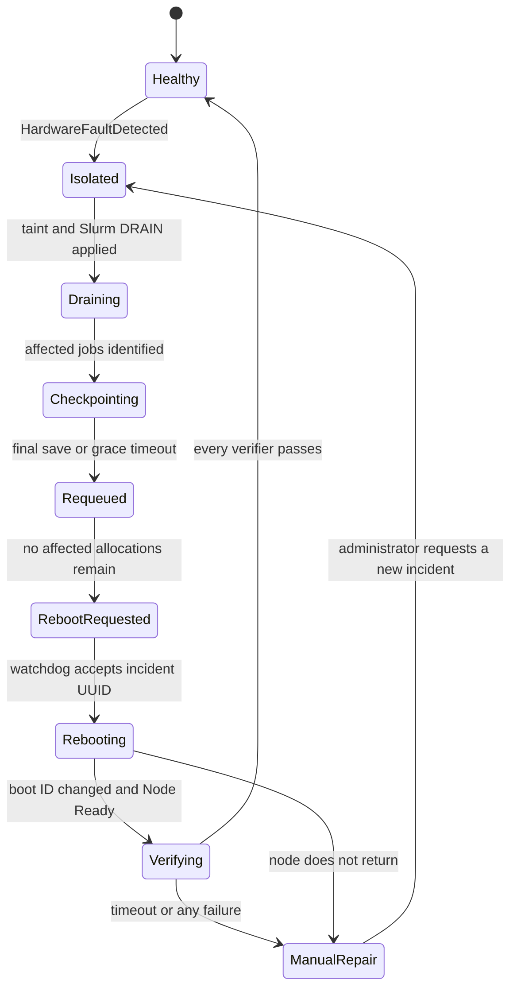

# Failure Recovery

## Recovery objective

When physical CPU, memory, or NVIDIA hardware degrades, the platform must:

1. prevent new work from reaching the physical node;
2. stop and requeue every Slurm job that used a worker on that node;
3. leave unrelated jobs running;
4. reboot only after affected jobs no longer own the failed workers;
5. verify the complete advertised resource inventory; and
6. return the node to service only after verification succeeds.

All ranks of an affected multi-node or heterogeneous job are stopped, including
ranks on otherwise healthy nodes. Other jobs on those healthy nodes are not
touched.

The OpenTPU target is software simulation. A PyRTL process or adapter failure is
a workload/software failure: recreate its worker and requeue its job, but do not
mark physical hardware degraded unless a CPU, memory, or node probe also fails.

## Detection

Kubernetes [Node Problem Detector](https://github.com/kubernetes/node-problem-detector)
runs as a DaemonSet and owns the `HardwareFaultDetected` Node condition. Custom
plugins inspect:

- NVIDIA critical Xid events, NVML availability, and device enumeration;
- CPU machine-check and EDAC uncorrectable errors;
- NUMA memory errors and a bounded read/write checksum; and
- disappearance or corruption of an expected PCI device.

An uncorrectable event is reported immediately. A non-fatal probe must fail
three consecutive ten-second checks before becoming a permanent condition.
Probe scripts return only healthy, unhealthy, or unknown; the operator owns all
policy and remediation. The `watchdog-daemon` supplies fixed host inventory and
health-support operations to those probes, but Node Problem Detector remains the
only writer of the raw condition.

The operator derives `HardwareDegraded=True`, records the incident UUID, and
adds:

```text
orchestration.gputpu.io/hardware-degraded=true:NoSchedule
```

`NoExecute` is intentionally not used. Automatic Pod eviction could kill
`slurmd` before Slurm coordinates checkpoint and requeue.

## State machine



| Phase | Required durable evidence |
| --- | --- |
| `Healthy` | Raw fault false, derived degradation false, no degradation taint |
| `Isolated` | Incident UUID, `HardwareDegraded=True`, `NoSchedule` taint |
| `Draining` | Every mapped dynamic Slurm node is `DRAIN` or unavailable |
| `Checkpointing` | Affected job IDs and signal/grace timestamps recorded |
| `Requeued` | Jobs are pending/requeued and no longer allocated to failed workers |
| `RebootRequested` | Worker Pods removed, dynamic nodes deleted, pre-reboot boot ID recorded |
| `Rebooting` | `watchdog-daemon` acknowledged the incident UUID |
| `Verifying` | New boot ID, Node Ready, and verifier Jobs owned by the incident |
| `ManualRepair` | Taint retained and terminal reason recorded |

The phase is an annotation on the Node and is reconstructable from Kubernetes
objects plus Slurm state. An operator restart never skips a phase merely because
an annotation is stale.

## Isolation, checkpoint, and requeue

The operator first taints the physical Kubernetes node, then maps every owned
worker Pod on it to its Slurm dynamic-node name. It issues Slurm `DRAIN` with the
incident UUID as the reason. `DRAIN` blocks new jobs while allowing controlled
handling of existing allocations.

For each job using any affected dynamic node, the operator:

1. marks the complete Slurm job affected, not merely one component or step;
2. sends `USR1` to surviving ranks so the application may checkpoint;
3. waits for a MinIO v2 commit or the configured 120-second grace period;
4. invokes Slurm requeue once; and
5. confirms the job is pending/requeued and has no allocation on an affected
   worker.

Slurm requeue restarts the batch script under the same job ID, and the script
loads the newest valid checkpoint. See the Slurm
[`--requeue` behavior](https://slurm.schedmd.com/sbatch.html). A failed final
save falls back to the prior `.complete` checkpoint.

After all affected jobs leave, the operator deletes idle dynamic Slurm nodes,
their worker Pods, and their claims. It does not wait for the requeued jobs to
start elsewhere; confirmed placement back in the queue is the reboot barrier.
Elastic reconciliation creates replacement workers only on healthy nodes.

If `slurmrestd` or both controllers are unavailable, the node remains isolated
and no reboot is requested. Losing the ability to prove job evacuation is a
stop condition, not permission to continue.

## Watchdog daemon

The privileged `watchdog-daemon` runs only on dedicated compute nodes and
tolerates both platform taints. It watches its own Node for:

```text
orchestration.gputpu.io/reboot-request=<incident-uuid>
```

Before rebooting, it verifies that the request is new, the Node is degraded,
the recovery phase is `RebootRequested`, and no platform worker Pod remains on
the node. It records acknowledgement and invokes the host's normal reboot
mechanism. It never accepts a shell command or arbitrary action from an
annotation.

The operator permits one automatic reboot per incident. It records the old
`Node.status.nodeInfo.bootID` and waits for a different boot ID plus `Ready=True`.
Failure to return before the configured infrastructure timeout moves the node to
`ManualRepair`; a local DaemonSet cannot repair a node that never comes back or
is unreachable enough to miss the reboot request.

## Post-reboot verification

The degradation and dedicated-node taints remain in place. Verifier Pods carry
explicit tolerations and exact hostname affinity, so no ordinary workload can
use the node during verification.

After a 30-second Ready stabilization period, the operator asks the watchdog for
a fresh host inventory and compares the new DRA inventory with the pre-fault
snapshot. Missing devices, changed identities, or missing node plugins fail
immediately. It then creates one lightweight verifier Pod per NUMA cell, in
parallel, with a two-minute overall timeout.

Each verifier claims one CPU core and one memory unit on its cell. It also claims
every expected NVIDIA device on that cell and one slot for each configured
OpenTPU simulation profile. It runs:

- deterministic CPU arithmetic and a bounded memory write/read checksum;
- a minimal CUDA allocation and kernel on every claimed GPU, followed by an
  NVML health and UUID check; and
- an OpenTPU 8×8 matrix multiplication with a known result.

All Pods, claims, DRA preparations, checks, and cleanups must succeed. OpenTPU
validates the software/runtime path; it does not turn the simulator into a
physical health signal.

On complete success, the operator sets `HardwareDegraded=False`, removes the
degradation taint and recovery annotations, and allows elastic workers to be
created. Stale dynamic Slurm nodes are never undrained; new Pods register new
dynamic nodes from freshly allocated claims.

On any failure or timeout, the operator sets reason `VerificationFailed`, keeps
`HardwareDegraded=True` and the taint, emits an Event, and stops automatic
retries. An administrator may repair the node and request a new incident; merely
clearing the Slurm drain is insufficient.

## Idempotency and races

- Incident UUID is the idempotency key for taint, drain, signal, requeue,
  reboot, and verifier resources.
- New raw faults during recovery attach to the current incident rather than
  starting a parallel reboot.
- A claim or worker created just before isolation is immediately drained and
  included in the affected set.
- A job already requeued is not signaled or requeued twice.
- The `.complete` marker determines checkpoint success; operator memory and
  flusher receipts do not.
- A verifier from an older incident cannot clear a newer degradation condition.
- Manual removal of the degradation taint is reconciled back while the derived
  condition remains true.
- The watchdog never mutates a Slurm job or clears a Kubernetes quarantine;
  those decisions remain operator-owned.

## Failure matrix

| Failure | Platform response |
| --- | --- |
| One worker process crashes, hardware healthy | Recreate worker; requeue its affected jobs; no physical-node reboot |
| OpenTPU simulator crashes | Recreate worker and requeue affected job |
| GPU/CPU/memory hard fault | Full isolate, requeue, reboot, and verify flow |
| Checkpoint upload interrupted | Ignore uncommitted step and use prior commit |
| MinIO unavailable during fault | End grace period, requeue from prior commit, alert |
| Slurm REST unavailable | Keep node isolated; do not reboot until allocation state is proven |
| Primary controller fails | Backup controller takes over shared state |
| Operator restarts | Reconstruct incident and continue the current phase |
| Node never returns after reboot | Retain degraded state for out-of-band repair |
| Verification fails | Retain taint and stop after one automatic reboot |

## Manual recovery

An administrator inspects the Node conditions, incident Events, NPD logs,
operator status, verifier logs, and Slurm drain reason. After physical repair,
the administrator requests a new recovery incident through the supported
operator action. The operator repeats inventory and verification before clearing
quarantine; administrators do not directly remove the taint or force Slurm
`RESUME`.
