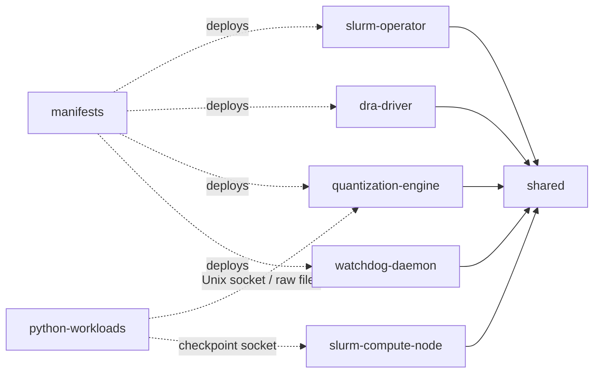

# Repository Layout

This is the authoritative source layout for implementation. The repository is
currently documentation-only; the paths below describe where code will be added
by the implementation phases.

```text
heterogeneous-ai-orchestrator/
├── go.work
├── Makefile
├── README.md
├── docs/
└── src/
    ├── shared/
    │   ├── go.mod
    │   ├── ipc/
    │   ├── storage/
    │   └── checkpoint/
    ├── slurm-operator/
    │   ├── go.mod
    │   ├── api/v1alpha1/
    │   ├── controllers/
    │   ├── internal/
    │   ├── main.go
    │   └── Dockerfile
    ├── dra-driver/
    │   ├── go.mod
    │   ├── internal/
    │   ├── main.go
    │   └── Dockerfile
    ├── quantization-engine/
    │   ├── go.mod
    │   ├── internal/
    │   ├── main.go
    │   └── Dockerfile
    ├── watchdog-daemon/
    │   ├── go.mod
    │   ├── internal/
    │   ├── main.go
    │   └── Dockerfile
    ├── slurm-compute-node/
    │   ├── go.mod
    │   ├── cmd/
    │   │   ├── gres-init/
    │   │   ├── checkpoint-flusher/
    │   │   └── cloud-burst/
    │   ├── internal/
    │   └── Dockerfile
    ├── python-workloads/
    │   ├── opentpu-harness/
    │   │   ├── requirements.txt
    │   │   └── runtime.py
    │   └── pytorch-coordinator/
    │       ├── requirements.txt
    │       └── train.py
    └── manifests/
        ├── crds/
        ├── rbac/
        ├── workloads/
        └── kustomization.yaml
```

`myorg.com/ai-orch` is the working Go module prefix shown in design examples.
Replace `myorg.com` once the project owns a permanent module domain; do it
before publishing any Go module, not piecemeal afterward.

## Root workspace

`go.work` lists each Go module under `src/` but is not used as a release or
deployment artifact. Every module must build and test independently with its
own `go.mod` and `go.sum`.

The root `Makefile` delegates a small common command set:

- `make build` builds every Go binary and checks Python syntax;
- `make test` runs module tests and Python tests;
- `make generate` regenerates CRDs, deepcopy code, and RBAC;
- `make manifests` renders Kustomize output without applying it; and
- `make verify` checks generated-file drift, formatting, schemas, and docs.

It does not hide module-specific toolchains or implement a second build system.

## Module ownership

### `src/shared`

Module: `myorg.com/ai-orch/shared`

Only genuinely cross-cutting protocol code belongs here:

- `ipc`: memory-mapped files, bounds-checked regions, process-shared semaphores,
  ownership headers, cleanup, and the node-local socket protocol;
- `storage`: MinIO streaming, hashing, conditional commits, raw tensor I/O, and
  Safetensors import/export at framework boundaries; and
- `checkpoint`: manifest v2 Go types plus schema and semantic validation.

The durable checkpoint format remains headerless raw `.bin` chunks. Safetensors
support converts to or from that canonical format; it does not replace the
manifest or alter objects under `shards/`.

`shared` must not import any other project module.

### `src/slurm-operator`

Module: `myorg.com/ai-orch/slurm-operator`

This is the Kubernetes control plane. `api/v1alpha1` contains the
`HeterogeneousCluster` API, generated deepcopy code, and group registration.
Controllers are split by reconciliation responsibility, not by generic layers:

- cluster control plane and configuration;
- elastic workers and ResourceClaims; and
- hardware recovery.

`internal/slurm` contains the typed `slurmrestd` client;
`internal/resources` maps Slurm demand to DRA requests; and `internal/render`
renders Slurm configuration and Kubernetes workloads. No other module imports
operator internals.

### `src/dra-driver`

Module: `myorg.com/ai-orch/dra-driver`

One deployable driver owns several provider implementations under
`internal/providers`: NVIDIA, CPU, NUMA memory, and OpenTPU simulation. Shared
driver code handles ResourceSlice publication, claim preparation, CDI/NRI, and
state recovery. Provider packages own discovery and preparation details but
publish the same qualified topology attributes.

This remains one module and one node-plugin image until different release or
privilege requirements make a split necessary.

### `src/quantization-engine`

Module: `myorg.com/ai-orch/quant-engine`

This node-wide DaemonSet performs canonical FP32/BF16 to OpenTPU INT8 conversion
and the inverse operation. It uses `shared/ipc` and `shared/storage` and exposes
a versioned Unix-socket protocol.

Workers and the engine mount the same node-local tmpfs directory at
`/dev/shm/ai-orch`. Files are namespaced by cluster UID, Slurm job ID, rank, and
transaction ID. Synchronization primitives live inside the mapped files, so
Pods do not require `hostIPC`.

The engine never commits a checkpoint. It only converts bounded buffers and
returns a hashable result to `checkpoint-flusher`.

### `src/watchdog-daemon`

Module: `myorg.com/ai-orch/watchdog`

This is the privileged companion to Node Problem Detector. It executes only the
fixed health-support, inventory, reboot, and verification operations defined by
the recovery protocol. It watches its own Node and cannot execute arbitrary
annotation content or mutate Slurm state.

Node Problem Detector remains an upstream dependency and publishes the raw
hardware condition; the watchdog is not a replacement health framework.

### `src/slurm-compute-node`

Module: `myorg.com/ai-orch/slurm-compute`

The image contains `slurmd`, MUNGE, and three focused binaries:

- `gres-init` validates DRA allocations and writes `gres.conf` plus the dynamic
  node configuration;
- `checkpoint-flusher` owns the worker-local checkpoint socket, raw MinIO
  transfers, validation, and commit calls; and
- `cloud-burst` implements idempotent Slurm `ResumeProgram`/`SuspendProgram`
  requests to the operator.

V1 elasticity continues to use operator polling. When Slurm power-save hooks are
enabled, the `cloud-burst` artifact must also be copied into the controller
image because those hooks execute on `slurmctld`; it must not mutate Kubernetes
directly.

### `src/python-workloads`

These are reference workloads and conformance harnesses, not shared production
libraries:

- `opentpu-harness` wraps the upstream PyRTL simulator and the quantization IPC
  contract; and
- `pytorch-coordinator` demonstrates heterogeneous training, periodic
  checkpoint barriers, requeue, and restore.

Requirements are pinned per workload. A Go module must not shell out to these
sources as an internal API.

### `src/manifests`

`crds/` and generated RBAC are outputs of `make generate`. `workloads/` contains
the operator, unified DRA driver, quantization-engine DaemonSet,
watchdog-daemon DaemonSet, Node Problem Detector configuration, and supporting
Services. The root Kustomization composes those resources; environment overlays
are added only when a real environment needs different values.

## Dependency direction



There are no imports between deployable Go modules. Cross-process behavior uses
Kubernetes APIs, Slurm APIs, versioned Unix sockets, and the checkpoint schema.
This keeps each image independently buildable and prevents `shared` from
becoming a home for operator-specific abstractions.
