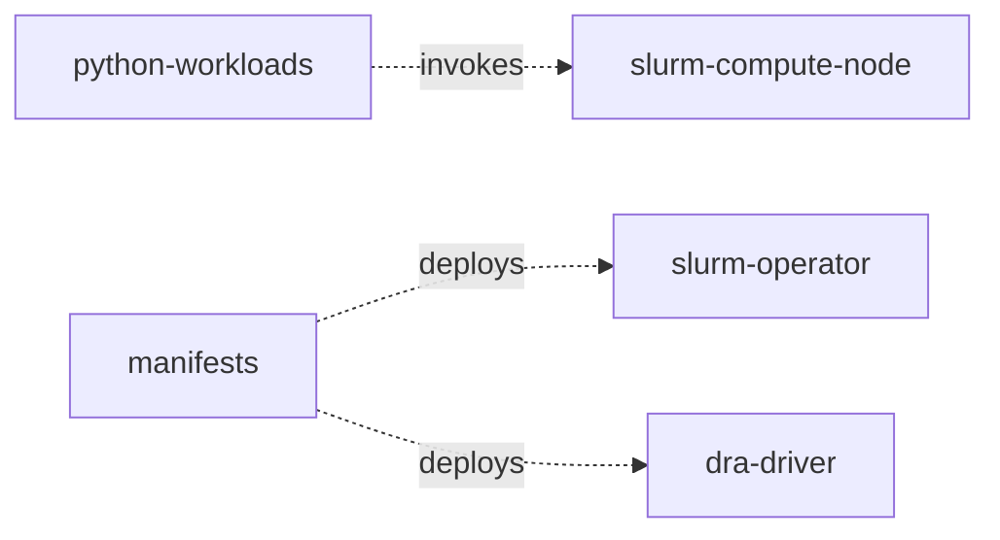

# Repository Layout

This is the authoritative source layout for implemented components. New
phase-specific modules are added only when they contain behavior.

```text
heterogeneous-ai-orchestrator/
├── go.work
├── Makefile
├── versions.mk
├── README.md
├── docs/
└── src/
    ├── slurm-operator/
    │   ├── go.mod
    │   ├── api/v1alpha1/
    │   ├── controllers/
    │   ├── internal/
    │   ├── main.go
    │   └── Dockerfile
    ├── dra-driver/
    │   ├── go.mod
    │   ├── internal/
    │   ├── main.go
    │   └── Dockerfile
    ├── slurm-compute-node/
    │   ├── go.mod
    │   ├── cmd/
    │   │   └── gres-init/
    │   ├── internal/
    │   └── Dockerfile
    ├── python-workloads/
    │   └── opentpu-harness/
    │       └── runtime.py
    └── manifests/
        ├── crds/
        ├── rbac/
        ├── workloads/
        └── kustomization.yaml
```

The permanent Go module prefix is
`github.com/varrahan/hetero-cluster-orchestrater/src`, matching the canonical
Git repository and the physical module locations. A repository rename requires
an atomic update to every module and import path.

## Root workspace

`go.work` lists each Go module under `src/` but is not used as a release or
deployment artifact. Every module must build and test independently with its
own `go.mod` and `go.sum`.

The root `Makefile` delegates a small common command set:

- `make build` builds every Go binary and checks Python syntax;
- `make test` runs module tests and Python tests;
- `make generate` regenerates CRDs, deepcopy code, and RBAC;
- `make manifests` renders Kustomize output without applying it; and
- `make verify` checks version pins, generated-file drift, formatting, builds,
  tests, vet, JSON syntax, and rendered manifests.

Go tests live under `src/test/` in paths mirroring their production packages.
`make test` overlays them onto disposable module copies so same-package tests
retain access to unexported implementation without mixing test and production
files in the source tree.

It does not hide module-specific toolchains or implement a second build system.
Exact Go, Kubernetes, Slurm, and OpenTPU revisions live in the root
`versions.mk`; floating tags are not release inputs.

## Module ownership

### `src/slurm-operator`

Module: `github.com/varrahan/hetero-cluster-orchestrater/src/slurm-operator`

This is the Kubernetes control plane. `api/v1alpha1` contains the
`HeterogeneousCluster` API, generated deepcopy code, and group registration.
Controllers are split by reconciliation responsibility, not by generic layers:

- cluster control plane and configuration;
- elastic workers and ResourceClaims; and
- hardware recovery.

`internal/slurm` contains the typed `slurmrestd` client;
`internal/resources` maps Slurm demand to DRA requests; and `internal/render`
renders Slurm configuration and Kubernetes workloads. No other module imports
operator internals.

### `src/dra-driver`

Module: `github.com/varrahan/hetero-cluster-orchestrater/src/dra-driver`

One deployable driver owns several provider implementations under
`internal/providers`: NVIDIA, CPU, NUMA memory, and OpenTPU simulation. Shared
driver code handles ResourceSlice publication, claim preparation, CDI/NRI, and
state recovery. Provider packages own discovery and preparation details but
publish the same qualified topology attributes.

This remains one module and one node-plugin image until different release or
privilege requirements make a split necessary.

### `src/slurm-compute-node`

Module: `github.com/varrahan/hetero-cluster-orchestrater/src/slurm-compute-node`

The image contains `slurmd`, MUNGE, and one focused binary:

- `gres-init` validates DRA allocations and writes `gres.conf` plus the dynamic
  node configuration.

### `src/python-workloads`

These are reference workloads and conformance harnesses, not shared production
libraries:

- `opentpu-harness` wraps the upstream PyRTL simulator.
- `checkpointing` provides the thin CPU, PyTorch, and PyRTL adapters plus the
  batch lifecycle helper.

Requirements are pinned per workload. A Go module must not shell out to these
sources as an internal API.

### Phase 3 checkpoint modules

`src/shared` owns only versioned checkpoint, optimizer, and atomic-ring wire
contracts. `src/checkpoint-flusher` owns MinIO, hashing, commit, restore, and
worker-local staging. `src/quantization-engine` owns bounded OpenTPU numeric
conversion and has no storage credentials.

### `src/manifests`

`crds/` and generated RBAC are outputs of `make generate`. `workloads/` contains
the operator, unified DRA driver, and supporting resources. The root
Kustomization composes those resources; environment overlays are added only
when a real environment needs different values.

## Dependency direction



There are no imports between deployable Go modules. Cross-process behavior uses
Kubernetes APIs, Slurm APIs, versioned Unix sockets, and the checkpoint schema.
This keeps each image independently buildable and prevents `shared` from
becoming a home for operator-specific abstractions.
