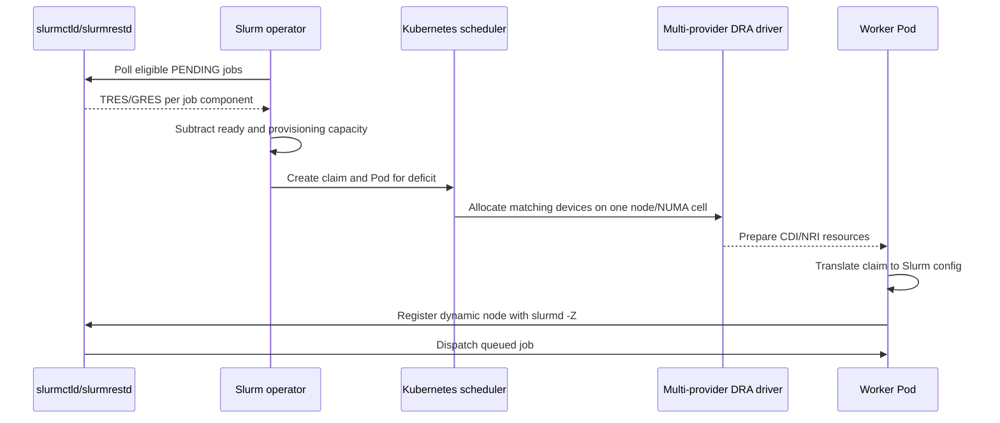

# Scheduling and Resources

## Scheduling boundary

The platform does not fork or replace `kube-scheduler`. The operator converts
eligible Slurm demand into Pods and stable DRA `ResourceClaim`s; the default
scheduler performs node and device allocation. The CPU and NUMA-memory
providers make cores and discrete memory units selectable devices so all
resources can be matched before a worker starts.

NVIDIA, CPU, NUMA-memory, and OpenTPU behavior ships in one multi-provider
`dra-driver` binary and node-plugin image. Providers share the same lifecycle
and topology attributes; they are not independently deployed drivers in v1.

This design uses the stable `resource.k8s.io/v1` core. It does not depend on
device taints, consumable capacity, partitionable devices, resource health, or
DRA-managed node-allocatable resources because those features are not stable in
the target baseline. See the Kubernetes
[DRA feature documentation](https://kubernetes.io/docs/concepts/scheduling-eviction/dynamic-resource-allocation/).

## Dedicated compute nodes

Strict worker pools select nodes labeled
`orchestration.gputpu.io/compute=true`. They tolerate the optional
`orchestration.gputpu.io/compute:NoSchedule` taint so administrators can keep
unrelated Pods off compute nodes without changing the allocation contract.

The CPU and memory providers reserve configurable system headroom before
publishing devices. The default memory device is one exclusive 1 GiB unit.
Large hosts may choose a larger unit to reduce the number of published devices,
trading allocation granularity for lower API volume.

Every provider publishes the shared scalar attribute
`orchestration.gputpu.io/numaNode`. GPU devices additionally publish UUID,
normalized model, VRAM, PCI address, and device path. CPU devices publish
logical CPU, core, and socket IDs. Memory devices publish their unit size.
OpenTPU simulation slots publish profile, matrix size, CPU count, memory, and
shared-memory footprints.

On WSL 2, NVIDIA allocation uses `/dev/dxg` and CDI bind-mounts the host driver
files individually. Native Linux continues to use the NVIDIA CDI generator.

## Exact placement

A worker uses one multi-request claim:

1. request the required number of individual CPU devices;
2. request `ceil((job memory + worker headroom) / memoryUnit)` memory devices;
3. optionally request NVIDIA GPU or OpenTPU simulation devices; and
4. apply `matchAttribute: orchestration.gputpu.io/numaNode` across every
   request.

The worker Pod uses equal CPU and memory requests and limits. CDI injects the
selected accelerator, while NRI applies the selected CPU set and NUMA memory
policy. Because each worker represents one NUMA cell and DRA devices are
exclusive, the claim is both the reservation and the binding authority.

If a request exceeds one NUMA cell, the operator does not silently relax the
policy. It leaves the Slurm component pending with a topology-unsatisfied reason.
A future worker pool may expose a separate, explicitly best-effort partition.

## Demand to worker flow



The five-second poll considers only jobs that are pending, eligible to run, and
waiting for resources. Priority-, dependency-, reservation-, account-, or QOS-
blocked jobs do not create workers. For a heterogeneous Slurm job, each
component is planned independently but capacity is created for the complete
co-scheduled request. Slurm natively represents these components; see
[heterogeneous job support](https://slurm.schedmd.com/heterogeneous_jobs.html).

For each resource profile, the operator computes:

```text
deficit = eligible demand - ready idle capacity - capacity already provisioning
```

It creates at most the pool's remaining `maxWorkers`. `minReady` defaults to
zero so scarce GPUs are not retained speculatively. A positive value preserves
that many compatible ready workers after demand has created them; it does not
invent a resource shape before Slurm supplies one.

For each pool with accelerator profiles, Slurm also receives one hidden
`FUTURE` catalog node. It advertises every allowed typed GRES up to the DRA
claim-size ceiling, but can never run a job. This lets native `sbatch` queue a
typed request even when current dynamic nodes have different shapes. The
partition's `DefMemPerNode` is the pool `memoryUnit`, so the catalog cannot
inflate an omitted memory request. Only live `slurmd -Z` registrations represent
allocatable inventory.

The five-second operator poll is the sole elasticity trigger.

## Worker startup

The operator creates the claim and its referencing Pod together. It constrains
the Pod with node affinity but never writes `spec.nodeName`, allowing normal
DRA scheduling and reservation.

The `gres-init` init container then:

1. reads its Pod and allocated claim through a read-only service account;
2. resolves each allocation back to its authoritative `ResourceSlice`;
3. enumerates resources visible inside the prepared container;
4. verifies driver, device UUID, model, NUMA cell, count, and device path;
5. fetches the configless cache, replaces its catalog `gres.conf` with the
   allocation-specific file, and writes the dynamic-node configuration;
6. runs `slurmd -G` against that exact cache as a validation step; and
7. exits successfully only when the DRA and Slurm views agree.

After `gres-init` succeeds, MUNGE starts and the main container registers with a
unique Pod-derived hostname and explicit Pod IP:

```text
slurmd -Z --conf "CPUs=8 Sockets=1 CoresPerSocket=8 ThreadsPerCore=1 RealMemory=15360 Gres=gpu:rtx_4050:1 Feature=pool_strict"
```

Presenting the claimed NUMA cell as one Slurm socket keeps GRES affinity within
Slurm's socket-level scheduling rules.

## DRA-to-Slurm translation

| DRA allocation | `gres.conf` / dynamic node | Validation |
| --- | --- | --- |
| NVIDIA RTX 4050 | `Name=gpu Type=rtx_4050 File=/dev/nvidia0 Cores=0-7` and `Gres=gpu:rtx_4050:1` | UUID, normalized model, and device path agree with `nvidia-smi`; `slurmd -G` passes |
| OpenTPU M8 simulation slot | `Name=tpu Type=opentpu_m8 Count=1 Flags=CountOnly` and `Gres=tpu:opentpu_m8:1` | Injected profile and runtime version match the claim |
| CPU cores | `CPUs`, socket/core fields, and feature `numa-<id>` | Effective process affinity equals claimed core IDs |
| Memory units | `RealMemory` is demanded memory excluding the separate `/dev/shm` footprint | Pod limit, rounded DRA units, and NUMA memory policy agree |

GRES types and models use lowercase ASCII with punctuation normalized to
underscores. A profile maps exactly one Slurm GRES name/type to one DRA
`DeviceClass`; aliases and fallback models are rejected in v1. Slurm requires
GPU GRES to be declared explicitly and can drain nodes on a detected mismatch,
so translation fails closed. See the Slurm
[GRES guide](https://slurm.schedmd.com/gres.html).

CPU is not represented as GRES. OpenTPU is `CountOnly` because it is a software
slot without a physical device file; Pod cgroups and DRA claims enforce its CPU
and memory isolation.

## Idempotency and cleanup

- The claim name is derived from its worker Pod, and the dynamic Slurm node uses
  the Pod name. Kubernetes owner references and cluster/pool labels prevent
  cross-cluster adoption.
- A `gres-init` failure leaves no registered Slurm node. The operator records
  the reason, deletes the failed Pod and claim, and retries with bounded
  exponential backoff.
- A ready worker becomes scale-down eligible only after it has been Slurm
  `IDLE`, unreserved, and above `minReady` for the pool's `idleTimeout`.
- An unready or unregistered worker with no remaining demand is removed
  immediately; `idleTimeout` applies only to usable registered capacity.
- A registered node whose claim is absent, unallocated, or no longer owned by
  its Pod is drained instead of having allocation state recreated beneath it.
- Scale-down drains the dynamic node, confirms it has no jobs or reservations,
  deletes it through Slurm, then deletes the Pod and claim.
- An unreachable Slurm API disables scale-down and destructive cleanup.
- An operator restart reconstructs capacity from owned Pods, claims, and Slurm
  dynamic nodes before creating or deleting anything.

## Scheduling acceptance rules

A resource path is correct only when all of these hold:

- two concurrent claims never receive the same CPU, memory unit, GPU, or
  OpenTPU slot;
- all resources in a strict worker share one NUMA attribute;
- the worker's cgroup and memory policy match the allocation;
- Slurm advertises no resource absent from the claim;
- a claim or GRES mismatch prevents registration;
- a heterogeneous job receives every component or remains queued; and
- no new worker schedules onto a quarantined physical node.
